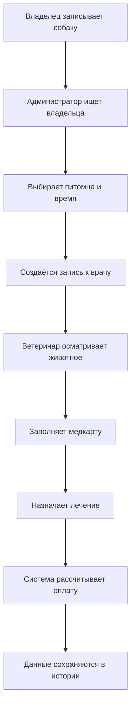

#  :heart_eyes_cat: PetCare :heart_eyes_cat:
> Информационная система для автоматизации работы ветеринарной клиники

---

## О проекте :bear:

**PetCare** — информационная система, предназначенная для автоматизации
основных процессов ветеринарной клиники.

Система позволяет хранить и обрабатывать информацию о животных, их
владельцах, ветеринарных врачах и проведённых приёмах.

Основная идея проекта — создание единого цифрового пространства, в котором
сотрудники ветеринарной клиники смогут быстро получать необходимую информацию.

---

## ***Цель проекта*** :elephant:

Разработка информационной системы для автоматизации основных процессов
ветеринарной клиники, сокращения количества бумажных документов и упрощения
работы администраторов и ветеринарных врачей.

### ***Основные возможности*** :hear_no_evil:

- хранение данных о животных и их владельцах;
- запись животных на приём;
- управление расписанием врачей;
- ведение электронных медицинских карт;
- хранение истории посещений;
- добавление диагнозов и назначений;
- учёт ветеринарных услуг;
- фиксация оплаты;
- формирование отчётности.

---

## ***Задачи проекта*** :kissing_cat:

| Задача | Описание |
|---|---|
| Учёт владельцев | Хранение контактных данных владельцев животных |
| Учёт животных | Создание карточки животного с основной информацией о нём |
| Запись на приём | Запись животного к определённому врачу на выбранные дату и время |
| Расписание врачей | Просмотр занятости и свободного времени специалистов |
| Медицинская карта | Хранение информации о состоянии здоровья животного |
| История посещений | Сохранение информации обо всех предыдущих приёмах |
| Диагностика | Добавление врачом диагноза после осмотра |
| Назначения | Хранение информации о лекарствах и рекомендациях |
| Учёт услуг | Хранение списка ветеринарных услуг и их стоимости |
| Оплата | Фиксация стоимости оказанных услуг и факта оплаты |
| Отчётность | Формирование информации о количестве приёмов и оказанных услугах |

---

## ***Основные сущности для хранения данных*** :hatched_chick:

| Сущность | Назначение | Основные атрибуты |
|---|---|---|
| Владелец | Информация о владельце животного | ID, ФИО, телефон, email |
| Животное | Основная информация о питомце | ID, кличка, вид, порода, пол, дата рождения, вес |
| Ветеринар | Информация о сотруднике клиники | ID, ФИО, специализация, телефон |
| Приём | Запись животного к врачу | ID, дата, время, животное, врач, статус |
| Медицинская карта | Медицинская информация о животном | ID, животное, аллергии, хронические заболевания, особенности |
| Диагноз | Информация о выявленном заболевании | ID, название, описание |
| Лечение | Назначенное животному лечение | ID, диагноз, препарат, дозировка, рекомендации |
| Услуга | Услуги ветеринарной клиники | ID, название, описание, стоимость |
| Оплата | Информация об оплате приёма | ID, приём, сумма, дата, способ оплаты |
| Кабинет | Помещения клиники | ID, номер, название, назначение |

---

## ***Роли пользователей*** :paw_prints:

### * *Администратор* *

Администратор отвечает за организационные процессы работы клиники:

- регистрация владельцев и животных;
- запись животных на приём;
- управление расписанием врачей.

###  *Ветеринар* 

Ветеринар отвечает за проведение приёмов и работу с медицинской информацией:

- просмотр медицинских карт;
- проведение приёмов;
- добавление диагнозов;
- добавление назначений.

###  *Руководитель* 

Руководитель получает доступ к информации о работе клиники:

- просмотр статистики клиники;
- просмотр информации о сотрудниках;
- просмотр количества приёмов;
- просмотр доходов.

---

## ***Пример работы системы*** :poodle:

---

## Результат :dog:

В результате разработки PetCare сотрудники ветеринарной клиники получают единое цифровое пространство для хранения и обработки информации о животных, владельцах, ветеринарах, приёмах, диагнозах, лечении и оплатах. 
